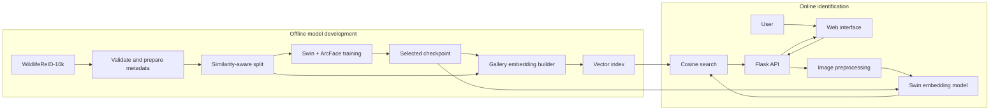
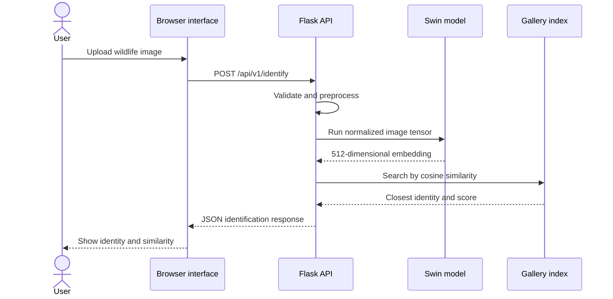

# Implementation architecture

## Component relationships

ArcFace is part of the training objective and is not used to select an identity
at runtime. The online model returns an L2-normalized embedding; the vector
index maps that representation to the closest known animal.

## Identification request

## Artifact compatibility

The checkpoint, preprocessing configuration, embedding dimension, and gallery
index must be versioned together. When the model changes, regenerate the entire
gallery with the new checkpoint before deploying it.

## Delivery increments

1. Run the API with a fake identifier and confirm upload/error behavior.
2. Prepare a small, representative dataset sample and metadata format.
3. Complete the model training loop and validation metrics.
4. Build a gallery from the selected checkpoint.
5. Connect the real inference service to the Flask application.
6. Evaluate Top-1, Top-5, mAP, latency, and failure cases.

